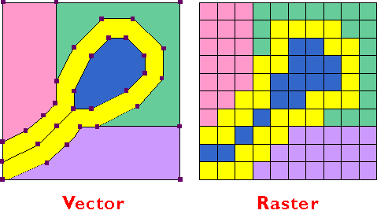

<h2 align="center"> Latar belakang masalah:</h2>
 
1.Apa itu Data? 
2.Apa itu Data Vektor? 
3.Apa itu Data Raster? 
4.Kelebihan dan kekurangan data Vektor? 
5.Kelebihan dan kekurangan data Raster? 

<strong>Isi:</strong>
&nbsp;&nbsp;&nbsp;&nbsp;Data adalah suatu bagian yang tidak dapat dipisahkan dalam Sistem Informasi Geografi. Data spasial terbagi menjadi dua macam yaitu data raster dan data vektor. 

    
    

&nbsp;&nbsp;&nbsp;&nbsp;Data vektor adalah data yang menampilkan bentuk keruangan dalam bentuk titk, garis, kurva atau poligon. Data vektor sangan baik dalam mempresentasikan fitur-fitur jaringan jalan, gedung, rel kereta, dan letak koordiant. 

&nbsp;&nbsp;&nbsp;&nbsp;Data raster merupakan data yang menampilkan sisi ruang pada bumi dalam bentuk pixel yang membentuk petak/grid dan dibuat dari penginderaan sangat jauh . Pada data raster, ukuran tergantung pada ukuran pixel nya. Semakin kecil ukuran pada permukaan bumi maka akan semakin tinggi pula resolusinya. Data raster sangat baik dalam menggambarkan keadaan jenis tanah, vegetas dan kelembaban pada tanah. kelemahannya terletak pada besarnya ukuran file nya, semakin tinggi resolusi pada gambar maka ukuran file akan semakin besar. 

<strong>Kesimpulan:</strong> di pertemuan kedua ini dapat disimpulkan data suatu bagian yang tidak bisa dipisahkan dalam sistem informasi geografis dan data dibagi menjadi dua yaitu data raster dan data vektor. 
<strong>Saran:</strong>strong> jika ingin mengetahui lebih lanjut dalam menggunakan aplikasi QGIS.