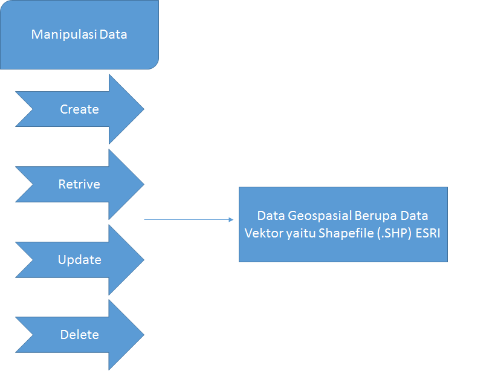

<h2 align="center"> Latar belakang masalah:</h2>
 
1. apa itu python?  
2. apa itu manipulasi data ? 
3. apa itu Retrive? 
4. sebutkan berapa cara yang bisa digunakan untuk membuka file? jelaskan caranya! 

    
    

<strong>Isi:</strong>
&nbsp;&nbsp;&nbsp;&nbsp;Sebuah Bahasa pemrograman yang mudah dipahamin dan memiliki strukur data yang efisien. Dan python ini dapat kita terapkan pada penentua jumlah shapefile.
Pada Shapefile ada dua jenis teknik yang kita gunakan dalam penentu tata letak, yaitu reader dan shapes. Reader untuk membaca file yang telah kita buat dan outputnya data dari file tersebut, contoh pada data file “negara.shp”. dan shapes untun membaca jumlah data yang ada pada file yaitu jumlah data yang ada sebanyak 254 data shp.
Dan proses ini dapat kita lakukan pada command prompt yang ada pada windows. 
&nbsp;&nbsp;&nbsp;&nbsp;Manipulasi data dan analisis ialah kegiatan yang dapat dilakukan berbagai macam perintah misalnya overlay antara dua tema peta, membuat buffer zone jarak tertentu dari suatu area atau titik dan sebagainya. Anon (2003) mengatakan bahwa manipulasi dan analisis data merupakan ciri utama dari GIS. Kemampuan GIS dalam melakukan analisis gabungan dari data spasial dan data atribut akan menghasilkan informasi yang berguna untuk berbagai aplikasi. 
&nbsp;&nbsp;&nbsp;&nbsp;Retrive data berfungsi untuk melihat isi data Geospasial berupa data vektor yaitu shapefile(.shp) 
File yang dibutuhkan: 
1.      Ship : koordinat/titik 
2.      Dbf : tabel/database 
3.      Shx : index data 
Ada 2 cara untuk membukanya: 
1.QGIS 
Dengan cara klik kanan ‘view data’ tetapi buka terlebih dahulu datanya dengan cara drag and drop 
2. Library pyshp 
Ini merupakan library dari bahasa pemrograman python. 

<strong>Kesimpulan:</strong>untuk mengetahui jumlah data pada lokasi kita dapat menggunakan python karena dapat menerapkan shapefile yaitu reader dan shapes. 
<strong>Saran:</strong> Jika ingin mengetahui lebih lanjut silahkan menggunakan python dan QGIS 